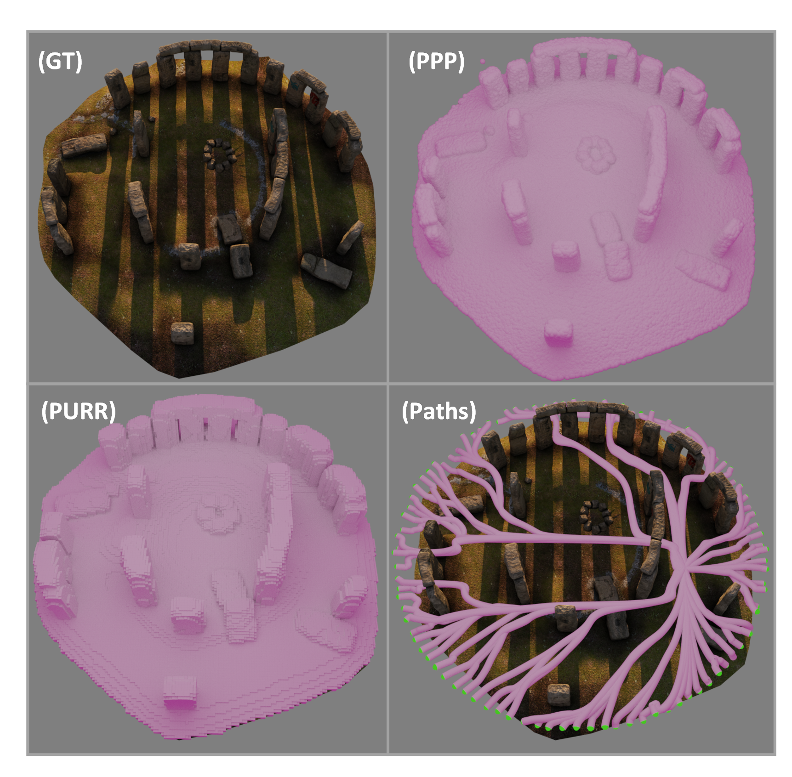
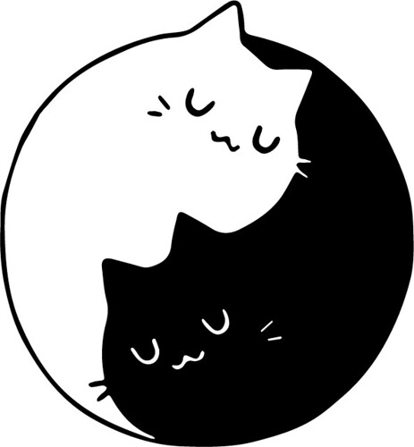
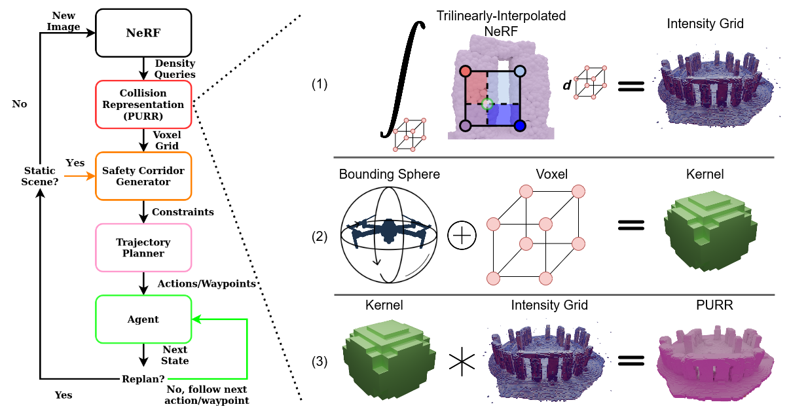

<!-- # CATNIPS
### [Project Page](https://chengine.github.io/catnips) | [Paper (TR-O)](https://ieeexplore.ieee.org/document/10494911) | [Paper (arXiv)](https://arxiv.org/abs/2302.12931) | [Data](https://drive.google.com/drive/folders/11O7o5811NJIaSq5jC7dqwMteKWDD3QtL?usp=sharing)
[CATNIPS: Collision Avoidance Through Neural Implicit Probabilistic Scenes](http://tancik.com/nerf)  
 [Timothy Chen](https://msl.stanford.edu/people/timchen)\*<sup>1</sup>,
 [Preston Culbertson](https://www.its.caltech.edu/~pculbert/)\*<sup>2</sup>,
 [Mac Schwager](https://web.stanford.edu/~schwager/)\*<sup>1</sup>,
 <sup>1</sup>Stanford, <sup>2</sup>Caltech
in IEEE Transactions on Robotics (2024)

 -->

<p align="center">

  <h1 align="center"> CATNIPS: Collision Avoidance Through Neural Implicit Probabilistic Scenes</h1>
  <p align="center"> 
    <a href="https://msl.stanford.edu/people/timchen"><strong>Timothy Chen</strong><sup>1</sup></a>
    ·
    <a href="https://www.its.caltech.edu/~pculbert/"><strong>Preston Culbertson</strong><sup>2</sup></a>
    ·
    <a href="https://web.stanford.edu/~schwager/"><strong>Mac Schwager</strong><sup>1</sup></a>
  </p>
  <p align="center"><strong><sup>1</sup>Stanford University</strong></p>
  <p align="center"><strong><sup>2</sup>Caltech</strong></p>
  <h2 align="center">IEEE Transactions on Robotics 2024</h2>
  <h3 align="center"><a href="https://chengine.github.io/catnips"> Project Page</a> | <a href="https://ieeexplore.ieee.org/document/10494911">Paper (TR-O)</a> | <a href="https://arxiv.org/abs/2302.12931">Paper (arXiv)</a> | <a href="https://drive.google.com/drive/folders/11O7o5811NJIaSq5jC7dqwMteKWDD3QtL?usp=sharing">Data</a></h3>
  <div align="center"></div>
</p>
<p align="center">
  <a href="">
    
  </a>
</p>
<h3 align="center">
A guaranteed safe robot planning pipeline for navigation in NeRFs
</h3>

## About
CATNIPS reasons about probabilistic safety and planning within Neural Radiance Fields (NeRFs). We relate the NeRF density field to a Poisson Point Process and reason about probabilistic safety with respect to a PPP. Moreover, using safety constraints built from the PPP, we construct a voxel grid representation of navigable space and construct safe corridors through this space. We then solve for a smooth spline path using a quadratic program. The proposed pipeline is real-time. 



## Dependencies
This repository is built off of [Nerfstudio](https://github.com/nerfstudio-project/nerfstudio/tree/main). Please first follow the installation instructions there before installing any of the dependencies specifically for this repository. Once you have Nerfstudio installed in your Conda environment, install the following dependencies in that environment.

* [dijkstra3d](https://github.com/seung-lab/dijkstra3d). This library is for planning A*.
* [cvxpy](https://github.com/cvxpy/cvxpy). This library is for solving the quadratic program. There is an option to use CVXPY itself (slower), or directly use CLARABEL (faster). CLARABEL is already included in CVXPY.

## Datasets
Our datasets are hosted on a [Google Drive](https://drive.google.com/drive/folders/11O7o5811NJIaSq5jC7dqwMteKWDD3QtL?usp=sharing). The scenes used in the paper are `flightroom`, `statues`, and `stonehenge`. The training data is in the `colmap` (for statues and flightroom) / `blender` (for stonehenge) folder, while the model is in `nerfacto`.

One way to ensure the repository can see the Nerfstudio model weights is to create a `data` folder and an `outputs` folder in the `catnips` folder. Then place the training data in the `data` folder, and the model weights in the `outputs` folder. 

Here's an example:
```
catnips
├── data                                                                                                       
│   └── colmap
│       └── flightroom
│           └── images
│           └── transforms.json                                                                                  
│                                                                                               
├──outputs                                                                                                                                                      
│   └── flightroom                                                                                                  
│       └── nerfacto                                                                                                                             
│           └── 2024-07-02_135009                                                                               
│               └── nerfstudio_models
|               └── config.yml
|               └── dataparser_transforms.json # This file contains the transform that transforms from "Data" frame to "Nerfstudio" frame (which is typically a unit box)
├── run.py
```

## Running CATNIPS
After the dependencies and the data is setup, navigate to the catnips folder, and run the script either as VSCode cells or in the command line
```
python run.py
```

The most important thing is to ensure that the path in NeRFWrapper is pointing to the right model location. For example, for the above example, `NeRFWrapper("./outputs/statues/nerfacto/2024-07-02_135009")`.

### Replicating the paper results and Baselines
The baselines (baseline grid and NeRF-Nav) folders are structured the same way as the `catnips` folder. Execute the `run.py`.

### Visualizing the paths
The outputs of the `run.py` scripts is a json containing a dictionary of paths, represented as waypoints. One way is to visualize them in Open3D and load each path as a PointCloud object. Another is to use an external visualizer like [Blender](https://www.blender.org/). In `catnips/scripts/viz_statistical_traj.py` is a Blender script (i.e. open the script in the Blender Scripting tab), where it will visualize the path if pointed to where the json is. In the same directory as the `path.json`, there is also a mesh of the PURR, as well as the corridors in .ply format.


## Generating your own scenes
To use your own datasets, simply train a Nerfstudio `nerfacto` model and follow the folder structure as illustrated above. If your images contain pixels that are transparent like in the case of synthetic scenes (i.e. the alpha value is 0), it is recommended to use the `instant-ngp-data` flag (e.g. `ns-train nerfacto --data {DATA} instant-ngp-data`) rather than `blender-data` or the default.

## Citation
If you found CATNIPS useful, consider citing us! Thanks!
```
@article{chen2024catnips,
  author={Chen, Timothy and Culbertson, Preston and Schwager, Mac},
  journal={IEEE Transactions on Robotics}, 
  title={CATNIPS: Collision Avoidance Through Neural Implicit Probabilistic Scenes}, 
  year={2024},
  volume={40},
  number={},
  pages={2712-2728},
  keywords={Robots;Collision avoidance;Trajectory;Cameras;Probabilistic logic;Planning;Three-dimensional displays;Collision avoidance;neural radiance fields (NeRFs);robot safety;visual-based navigation},
  doi={10.1109/TRO.2024.3386394}}
```